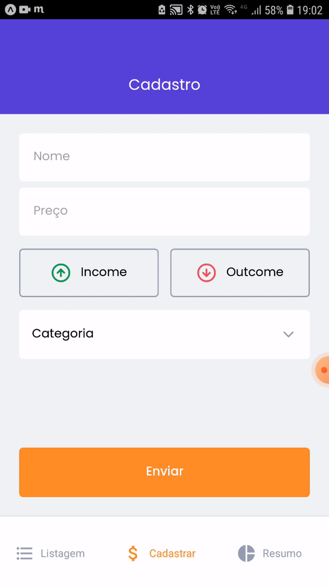

    

**goFinances** is a finance control app developed with React Native + Expo.
With this application you can have an easy overview of your daily transactions.

 

## 📸 Project GIF:

  
  
  

## 💻 Project:

### **Features**

- Authentication with Google or Apple;
- Transactions incomes/outcomes/total sum;
- Register transactions using React Hook Form;
  - Give a title to the transaction;
  - Pick a category (food, shopping, studies etc);
  - Register as income or outcome;
- List transactions;
- Save transactions in Async Storage;
- Pie chart with the outcomes percentage divided by category.

## 🚀 Technologies:

#### ✅ React Native

#### ✅ Expo

#### ✅ TypeScript

#### ✅ React Navigation

#### ✅ Styled Components

#### ✅ React Hook Form

#### ✅ Yup (form validation)

#### ✅ Victory Native (to develop the pie chart)
